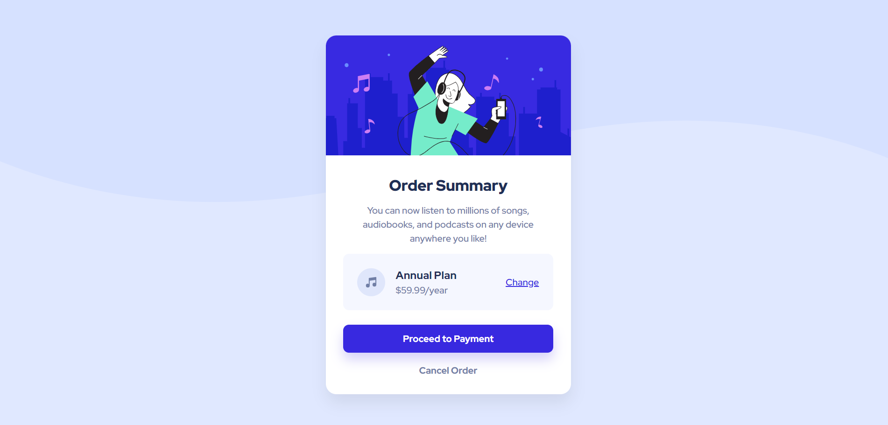

# Order summary card

## Overview

The challenge was to build out an order summary card component and get it looking as close to the design as possible. Check their design >> [Order summary card challenge on Frontend Mentor](https://www.frontendmentor.io/challenges/order-summary-component-QlPmajDUj).

Live Site URL: [CLICK ME](https://tp-order-summary-card.netlify.app/)

### Built with

- HTML5
- CSS (Custome properties, Flexbox + more)

### Useful resources

- [CSS-TRICKS](https://css-tricks.com/snippets/css/a-guide-to-flexbox/) - This helped gain an indepth understanding on how to utilise flexbox layout.
- [FreeCodeCamp](https://www.freecodecamp.org/news/use-svg-images-in-css-html/) - This is an amazing article which helped me understand how to use SVG as a CSS background image. I'd recommend it to anyone still learning this concept.
- [CS.FYI](https://cs.fyi/guide/writing-semantic-html) - Use this article to read about semantic HTML.
